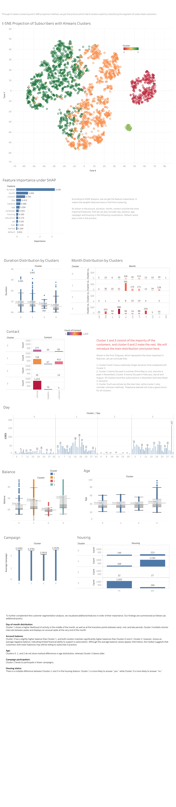

# Apziva Project B - Term Deposit Marketing

## Project Overview

This project focuses on predicting whether a customer will subscribe to a term deposit based on marketing campaign data. The goal is to build a robust classification model that helps financial institutions identify potential subscribers, enabling more efficient marketing resource allocation.

The project implements a comprehensive machine learning pipeline including:
- **Exploratory Data Analysis (EDA)** for understanding data distribution
- **XGBoost Classification** with threshold optimization for business-aligned predictions
- **SHAP Analysis** for model interpretability and feature importance
- **Customer Segmentation** using K-means clustering and t-SNE visualization

This project was developed as part of the Apziva program, demonstrating practical machine learning applications in financial services marketing.

> **Note:** Raw data files are not uploaded due to confidentiality. Please refer to `Apziva_Project_B_Term_Deposit_Marketing.pdf` for comprehensive analysis details.

## Core Features

### 1. Exploratory Data Analysis (EDA)
- Distribution visualization for all numeric and categorical features
- Duplicate sample detection
- Feature type identification (numeric vs. categorical)
- Statistical summary generation

### 2. XGBoost Classification with Threshold Optimization
- **Signed Log Transform**: Applied to skewed features like `balance` and `duration`
- **Robust Scaling**: Handles outliers in financial data
- **Class Imbalance Handling**: Uses `scale_pos_weight` parameter to balance positive/negative samples
- **5-Fold Stratified Cross-Validation**: Ensures robust model evaluation
- **Threshold Optimization**: Balances accuracy and recall based on business requirements

### 3. Model Interpretability with SHAP
- **SHAP Values Analysis**: Explains individual predictions
- **Feature Importance Ranking**: Identifies key drivers of customer subscription
- **Visualizations**: Summary plots (dot and bar formats)
- **XGBoost Built-in Importance**: Comparison with native feature importance

### 4. Customer Segmentation
- **K-Means Clustering**: Groups subscribers into distinct segments
- **PCA Dimensionality Reduction**: Reduces features to 10 principal components
- **t-SNE Visualization**: 2D projection of high-dimensional customer data
- **Silhouette Score Optimization**: Automatically finds optimal cluster count
- **Cluster Profiling**: Analyzes characteristics of each subscriber segment

## Technical Architecture

### Dataset Summary

| Metric | Value |
|--------|-------|
| Target Variable | `y` (yes/no - subscription) |
| Numeric Features | balance, duration, age, etc. |
| Categorical Features | job, marital, education, etc. |

### Data Preprocessing Pipeline

1. **Duplicate Removal**: `df.drop_duplicates()`
2. **Target Encoding**: Map 'yes'→1, 'no'→0
3. **Signed Log Transform**: Applied to `balance` and `duration`
4. **Robust Scaling**: StandardScaler/RobustScaler for numeric features
5. **Label Encoding**: Categorical variables converted to numeric

### Model Architecture: XGBoost Classifier

```
XGBClassifier(
    scale_pos_weight=neg/pos,  # Class imbalance handling
    eval_metric='logloss',
    random_state=42
)
```

**Key Parameters:**
- `scale_pos_weight`: Ratio of negative to positive samples
- `eval_metric`: Log loss for probabilistic predictions
- 5-fold Stratified Cross-Validation

### Threshold Optimization Strategy

The model searches for optimal classification threshold (0.0 to 0.9) that:
- Maintains minimum accuracy (default: 0.81)
- Maximizes positive class recall
- Balances precision-recall trade-off

### Clustering Pipeline

1. **Feature Selection**: Filter subscribers (y=1)
2. **Standardization**: StandardScaler for all features
3. **PCA**: Reduce to 10 components
4. **K-Means**: Find optimal K using silhouette scores (3-7)
5. **t-SNE**: 2D visualization with perplexity=30

### Key Features Analysis

Based on SHAP analysis, the most important features typically include:
- **duration**: Last contact duration (strongest predictor)
- **balance**: Average yearly balance
- **pdays**: Days since previous contact
- **previous**: Number of previous contacts
- **campaign**: Number of contacts during this campaign

## Quick Start

### Environment Setup

```bash
# Clone the repository
git clone https://github.com/chilly61/QNsPZTYN4LF0kDW7
cd QNsPZTYN4LF0kDW7

# Create virtual environment
python -m venv venv
source venv/bin/activate  # Linux/Mac
# or venv\Scripts\activate  # Windows

# Install dependencies
pip install pandas numpy matplotlib seaborn scikit-learn xgboost shap
```

### Running the Pipeline

```bash
# Step 1: Exploratory Data Analysis
python distribution.py

# Step 2: Train XGBoost model with threshold optimization
python XGBALG.py

# Step 3: SHAP Analysis
python SHAP.py

# Step 4: Customer Clustering and Visualization
python Clustering.py
```

### Output Files

- `shap_values.csv`: SHAP values for all predictions
- `shap_feature_importance.csv`: Ranked feature importance
- `tableau_tsne_clustered_customers.csv`: Clustered customer data for Tableau
- `predicted_subscribers_cluster_summary.csv`: Cluster statistics

## Project Structure

```
QNsPZTYN4LF0kDW7/
├── README.md                                    # This file
├── Apziva___Project_B__Term_Deposit_Marketing.pdf  # Full analysis report
├── distribution.py                               # EDA - Data distribution visualization
├── XGBALG.py                                    # XGBoost model training & threshold optimization
├── SHAP.py                                      # SHAP explainability analysis
└── Clustering.py                                # K-means clustering & t-SNE visualization
```

### File Descriptions

| File | Purpose |
|------|---------|
| `distribution.py` | Explores data distribution, detects duplicates, visualizes features |
| `XGBALG.py` | Trains XGBoost with 5-fold CV, optimizes classification threshold |
| `SHAP.py` | Computes SHAP values, generates feature importance plots |
| `Clustering.py` | Segments subscribers using K-means, visualizes with t-SNE |

## Performance Evaluation

### Model Performance Metrics

| Metric | Description |
|--------|-------------|
| Accuracy | Overall classification accuracy |
| Recall (Positive) | Ability to identify actual subscribers |
| Precision (Positive) | Accuracy of positive predictions |
| F1 Score | Harmonic mean of precision and recall |

### Threshold Trade-off Analysis

The threshold optimization process produces curves showing:
- **Accuracy vs Threshold**: Shows how accuracy changes with different thresholds
- **Recall vs Threshold**: Positive class recall at each threshold
- **Precision vs Threshold**: Positive class precision at each threshold

### Key Findings

1. **Duration is the Strongest Predictor**: Longer contact durations strongly correlate with subscription
2. **Balance Matters**: Customers with higher account balances are more likely to subscribe
3. **Previous Contact History**: Customers previously contacted show different patterns
4. **Class Imbalance**: The dataset typically has fewer subscribers than non-subscribers

### Clustering Insights

- **Optimal Cluster Count**: Determined by silhouette score analysis
- **Subscriber Segments**: Different clusters show distinct subscription rate patterns
- **Visualization**: t-SNE provides intuitive 2D representation of customer segments

## Challenges and Solutions

### Challenge 1: Class Imbalance

**Problem**: The dataset has significantly more non-subscribers than subscribers.

**Solution**: 
- Used `scale_pos_weight` parameter in XGBoost
- Applied stratified sampling in train/test split
- Optimized threshold to balance recall and precision

### Challenge 2: Feature Engineering for Financial Data

**Problem**: Financial features like `balance` and `duration` have skewed distributions.

**Solution**:
- Applied signed log transform: `sign(x) * log1p(|x|)`
- Used RobustScaler to handle outliers
- Combined with standard scaling for model input

### Challenge 3: Model Interpretability

**Problem**: Business stakeholders need to understand why predictions are made.

**Solution**:
- Implemented SHAP analysis for individual predictions
- Generated feature importance rankings
- Created visualizations for stakeholder communication

### Challenge 4: Customer Segmentation

**Problem**: Need to identify distinct subscriber groups for targeted marketing.

**Solution**:
- Applied PCA for dimensionality reduction
- Used silhouette scores to find optimal K
- Generated t-SNE visualizations for presentation

## Visualization

For advanced interactive visualizations, visit the Tableau dashboard:
**[Project B Dashboard](https://public.tableau.com/app/profile/yuhao.huang/viz/ProjectB_17648627756280/1_1?publish=yes)**



## Tech Stack

- **Data Processing**: pandas, numpy
- **Visualization**: matplotlib, seaborn
- **Machine Learning**: scikit-learn, xgboost
- **Explainability**: shap
- **Dimensionality Reduction**: PCA, t-SNE
- **Clustering**: K-Means

## Contributors

Thanks to the Apziva team for their support and guidance.

## License

This project is for internal use only.
